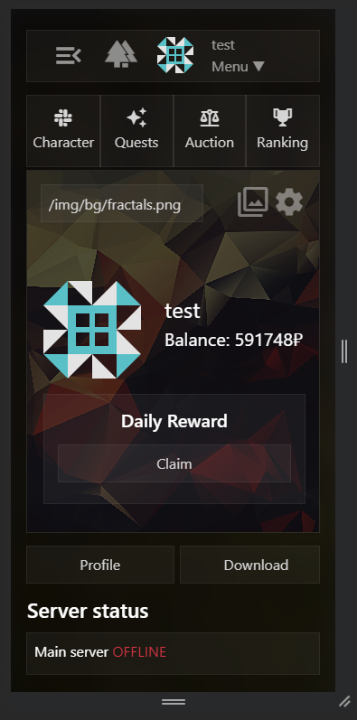

# Project.web
Website and integration for [Project](https://github.com/ExtevaXT/Project.unity)

http://dev.external.su

## Test account to check out features

<pre>login: test
password: test</pre>

## Key features
### Auction
Rendering of timestamps is by JS. No loops

### Dynamic Inventory
Functional view of ingame storage

### Achievements
Ranking is based on summary of your achievements

### Dynamic Profile
Ingame progression and stats of your character

### Themes and custom styles
And many more settings features

### Talents
Unlockables that affect your website interactions

### Dynamic Wiki
Parsed and rendered from Unity's YAML assets

### Notificatations
And auction delieveries to claim items and money

### Adapative Design
Grids on desktop. Flex on mobile

## Setup guide
* First need to clone this repo
* Next need php 8.2.4 with some php.ini extensions and composer to add vendor
* Then setup laravel project like in official docs
* Add in .env `DB_CONNECTION=sqlite` and link to db from project, also maybe need migrations this is also in docs. There is also recaptcha keys and mail in env to assign
* In config folder should be `github.php` with github token from some package, and also `services.php` with discord token
* To run use `php artisan serve`
* If installing on nginx this [config](docs/default) is working on my host, also need ssl by certbot. There are also some mini scripts for fixing read only: [fd](docs/fd) - fix db, [pa](docs/pa) - pull all, [pu](docs/pu) - pull unity, [pw](docs/pw) - pull web
* If something is not working try to debug it, cause there is hardcoded moments only for my host, github and discord
